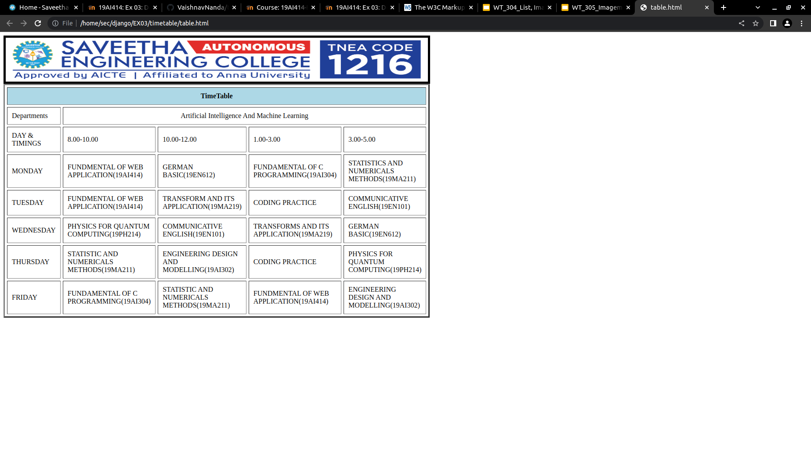

# Experiment_Time_Table

## AIM
To Write a html webpage page to display your timetable.

# ALGORITHM
### STEP 1
create a simple table using table tag
### STEP 2
Add header row using th tag
### STEP 3
Add your timetable
### STEP 4
Execute the program

# CODE
```
<BODY>
	
</BODY>


<TABLE BORDER="3" width="750" bgcolor="white" cellspacing="5" cellpadding="10"> 
    <TR> 
        <TH colspan="5" align="center" bgcolor="lightblue">TimeTable</TH>
    </TR>   
    <TR> 
        <TD rowspan="1" width="25%">Departments</TD>
        <TD colspan="4" Align="center">Artificial Intelligence And Machine Learning</TD> 
    </TR>
    <TR>
        <TD>DAY & TIMINGS</TD> 
        <TD>8.00-10.00</TD>
        <TD>10.00-12.00</TD>
        <TD>1.00-3.00</TD>
        <TD>3.00-5.00</TD>
        
        
    </TR>
    <TR>
        <TD>MONDAY</TD> 
        <TD>FUNDMENTAL OF WEB APPLICATION(19AI414)</TD>
        <TD>GERMAN BASIC(19EN612)</TD>
        <TD>FUNDAMENTAL OF C PROGRAMMING(19AI304)</TD>
        <TD>STATISTICS AND NUMERICALS METHODS(19MA211)</TD>
        
        
    </TR>

    <TR>
        <TD>TUESDAY</TD> 
        <TD>FUNDMENTAL OF WEB APPLICATION(19AI414)</TD>
        <TD>TRANSFORM AND ITS APPLICATION(19MA219)</TD>
        <TD>CODING PRACTICE</TD>
        <TD>COMMUNICATIVE ENGLISH(19EN101)</TD>
        
        
    </TR>
    <TR>
        <TD>WEDNESDAY</TD> 
        <TD>PHYSICS FOR QUANTUM COMPUTING(19PH214)</TD>
        <TD>COMMUNICATIVE ENGLISH(19EN101)</TD>
        <TD>TRANSFORMS AND ITS APPLICATION(19MA219)</TD>
        <TD>GERMAN BASIC(19EN612)</TD>
        
        
    </TR>
    <TR>
        <TD>THURSDAY</TD> 
        <TD>STATISTIC AND NUMERICALS METHODS(19MA211)</TD>
        <TD>ENGINEERING DESIGN AND MODELLING(19AI302)</TD>
        <TD>CODING PRACTICE</TD>
        <TD>PHYSICS FOR QUANTUM COMPUTING(19PH214)</TD>
        
        
    </TR>
    <TR>
        <TD>FRIDAY</TD> 
        <TD>FUNDAMENTAL OF C PROGRAMMING(19AI304)</TD>
        <TD>STATISTIC AND NUMERICALS METHODS(19MA211)</TD>
        <TD>FUNDMENTAL OF WEB APPLICATION(19AI414)</TD>
        <TD>ENGINEERING DESIGN AND MODELLING(19AI302)</TD>
        
        
    </TR>
    </TABLE>
    
```

# OUPUT

